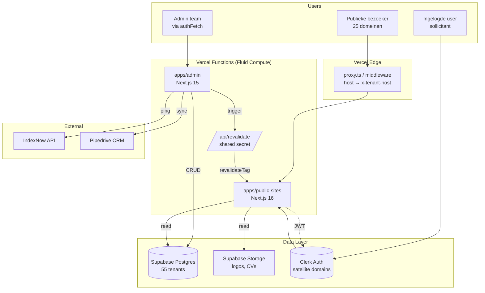

# Public Sites — Architectuur & Gap Analyse

**Auteur**: Claude (CTO-modus)
**Datum**: 2026-04-15
**Status**: Ter goedkeuring door Kenny
**Scope**: 25 regio-jobboards live zetten op Vercel met volledige CRUD/approval-koppeling vanuit admin

---

## 1. Executive Summary

### Huidige staat
- **Monorepo**: `apps/admin` (Next.js 15, klaar) + `apps/public-sites` (Next.js 16, ~80% klaar) + `apps/employer-portal` (placeholder)
- **1 van 55 platforms is live**: WestlandseBanen op `westlandsebanen.nl`
- **22 van 25 target platforms bestaan al** in DB met in totaal ~232k vacatures, allemaal nog `is_public=false`
- **Admin heeft al** approve/reject + CRUD voor vacatures. Werkt technisch.
- **Public-sites leest correct**: filter op `review_status='approved' AND published_at IS NOT NULL AND platform_id=tenant.id`

### Gewenste eindstaat (na dit project)
- 25 URLs live op Vercel subdomeinen (later .nl productie via DNS van Kay)
- Admin ↔ public-sites **real-time** gekoppeld via cache invalidation
- Volledige CRUD op vacatures reflecteert binnen 1-2 seconden op publieke site
- Platforms kunnen per stuk aan/uit via admin toggle
- Alle 25 platforms vindbaar + SEO-ready (sitemap, robots, schema.org, IndexNow)

### Kernbeslissing
**Eén codebase, host-based multi-tenant**. Geen 25 aparte deploys, geen 25 branches. Elke tenant is een DB row; de code is identiek. Dit is de enige schaalbare aanpak voor 50+ domeinen.

---

## 2. Huidige Systeem-overzicht

```
                    ┌─────────────────────────────────────────────────────┐
                    │                    BROWSERS                          │
                    └────────────────┬────────────────────────────────────┘
                                     │
                  ┌──────────────────┼──────────────────┐
                  │                  │                  │
                  ▼                  ▼                  ▼
      ┌───────────────────┐  ┌──────────────────┐  ┌─────────────────┐
      │  admin.xxx        │  │  westlands-      │  │  (24× nog niet  │
      │  (intern team)    │  │  ebanen.nl       │  │   live)          │
      │                   │  │  (1 live site)   │  │                  │
      │  Next.js 15       │  │  Next.js 16      │  │                  │
      │  apps/admin       │  │  apps/public-    │  │                  │
      │                   │  │  sites           │  │                  │
      └─────────┬─────────┘  └─────────┬────────┘  └─────────────────┘
                │                      │
                │ authFetch            │ Supabase SSR client
                │ (Bearer JWT)         │ (anon key + RLS)
                │                      │
                ▼                      ▼
      ┌───────────────────────────────────────────┐
      │              SUPABASE                      │
      │  wnfhwhvrknvmidmzeclh                      │
      │                                            │
      │  • platforms       (55 rows)              │
      │  • job_postings    (1M+ rows, 20 approved)│
      │  • companies                               │
      │  • user_profiles   (Clerk bridge)         │
      │  • saved_jobs                              │
      │  • job_applications                        │
      └───────────────────────────────────────────┘
                ▲                      ▲
                │                      │
                │ JWT "supabase"       │ JWT "supabase"
                │ template             │ template
                │                      │
      ┌─────────┴──────────────────────┴──────┐
      │              CLERK                     │
      │  Primary: auth.lokalebanen.nl          │
      │  Satellites: alle regio-domeinen       │
      └────────────────────────────────────────┘
```

---

## 3. Gap Analyse (CTO-view)

### 3.1 Data/Schema gaps

| # | Gap | Impact | Severity | Fix |
|---|-----|--------|----------|-----|
| D1 | `job_postings.updated_at` kolom bestaat niet, maar admin schrijft ernaar | Silent failure — PATCH werkt maar geen audit trail | 🔴 High | Migratie: kolom + trigger |
| D2 | `job_postings.company_name` kolom bestaat niet, admin schrijft ernaar | Silent failure — denormalisatie kapot | 🔴 High | Verwijder write (company al via FK) |
| D3 | `platforms.preview_domain` ontbreekt | Kan geen Vercel URL naast productie .nl URL houden | 🟡 Medium | Migratie: kolom + unique index |
| D4 | 3 platforms missen (Helmond, Oss, Roosendaal) | Kan die regio's niet live zetten | 🟡 Medium | INSERT 3 rows |
| D5 | Spelling `Nijmegensebanen` inconsistent | Branding / display issues | 🟢 Low | UPDATE query |
| D6 | `job_posting_platforms` junction wordt niet gelezen door public-sites | Kan vacature niet aan meerdere regio's koppelen (bv. Achterhoek = 4 steden) | 🟡 Medium | Later, als business het vraagt |

### 3.2 CRUD/Workflow gaps

| # | Gap | Impact | Severity | Fix |
|---|-----|--------|----------|-----|
| C1 | **Geen cache-invalidation admin → public-sites** | Zodra cache aan staat: approved vacatures verschijnen pas na X tijd op publieke site. Onacceptabel UX voor recruiters | 🔴 Critical | `revalidateTag` endpoint + helper |
| C2 | Geen single-job publish/unpublish | Admin kan 1 vacature niet offline halen zonder verwijderen | 🟡 Medium | 2 nieuwe API routes |
| C3 | Geen "platform go-live" wizard | Platform live zetten vereist 8+ losse DB updates (domain, hero, color, seo, etc.) | 🟡 Medium | Eén admin UI pagina |
| C4 | Bulk-approve heeft geen slug collision check | Theoretisch duplicate slugs mogelijk | 🟢 Low | Add check in bulk-approve |
| C5 | Geen image upload voor logo/og_image | URLs moeten handmatig ingevoerd | 🟡 Medium | Supabase Storage + upload UI |

### 3.3 Performance gaps

| # | Gap | Impact | Severity | Fix |
|---|-----|--------|----------|-----|
| P1 | **Geen caching in public-sites** | Elke request = Supabase query. Bij 25 sites × 1000 req/dag = 25k queries | 🔴 High | `use cache` + `cacheTag` activeren |
| P2 | `cacheComponents: true` staat uit in `next.config.ts` | Next.js 16 Cache Components niet benut | 🔴 High | Aanzetten na build-verificatie |
| P3 | Geen CDN image optimization voor company logos | Images worden direct vanuit source geladen | 🟡 Medium | `next/image` + `remotePatterns` (al deels) |
| P4 | Geen ISR / static generation voor landingspagina | Homepage rendert per request dynamisch | 🟡 Medium | `use cache` op homepage queries |

### 3.4 SEO/GEO gaps

| # | Gap | Impact | Severity | Fix |
|---|-----|--------|----------|-----|
| S1 | Geen IndexNow ping bij approved vacatures | Bing/Yandex indexeren pas na natuurlijke crawl (uren-dagen) | 🟡 Medium | IndexNow call na approve |
| S2 | `indexnow_key` niet per platform geconfigureerd | Geen IndexNow mogelijk | 🟡 Medium | UUID per platform + `.txt` file op root |
| S3 | JobPosting schema.org niet gevalideerd | Rich snippets werken mogelijk niet | 🟡 Medium | Validatie via Google Rich Results |
| S4 | `llms.txt` per tenant niet actief | AI zoekmachines (ChatGPT, Perplexity) vinden content niet | 🟡 Medium | `/llms.txt` route per tenant |
| S5 | Geen sitemap index voor master aggregator | Google moet 25 sitemaps handmatig ontdekken | 🟢 Low | Sitemap index op lokalebanen.nl |

### 3.5 DevOps/Deployment gaps

| # | Gap | Impact | Severity | Fix |
|---|-----|--------|----------|-----|
| O1 | 25 domeinen niet toegevoegd aan Vercel project | Geen URLs beschikbaar | 🔴 Critical (blocker) | Script + `vercel alias` |
| O2 | Geen monitoring per tenant | Weten niet welke site down is | 🟡 Medium | Vercel Analytics + Slack alerts |
| O3 | Geen rollback strategy per tenant | Fout in 1 tenant = alle 25 offline | 🟡 Medium | Feature flag per platform |
| O4 | Geen error tracking gecategoriseerd per tenant | Sentry errors niet filterbaar | 🟢 Low | `tenant_id` tag in Sentry |

### 3.6 Security gaps

| # | Gap | Impact | Severity | Fix |
|---|-----|--------|----------|-----|
| X1 | Geen shared secret tussen admin ↔ public-sites revalidate | Iedereen kan publieke site cache-busten | 🔴 Critical | `REVALIDATE_SECRET` env var |
| X2 | RLS policies niet geverifieerd op nieuwe tabellen | Data leak mogelijk tussen tenants | 🔴 Critical | Run `mcp__supabase__get_advisors` na DDL |
| X3 | Clerk JWT → Supabase bridge niet getest voor 25 satellites | Sign-in op `utrechtsebanen.vercel.app` kan falen | 🟡 Medium | E2E test per 5 willekeurige tenants |
| X4 | Geen rate limiting op publieke API routes | Scrapers/bots kunnen DB hammeren | 🟡 Medium | Vercel BotID of Upstash rate-limit |

---

## 4. Target Architectuur

### 4.1 High-level System Overview



### 4.2 Multi-tenant routing flow

```
┌─────────────────────────────────────────────────────────────────┐
│  Browser: GET https://utrechtsebanen.vercel.app/vacatures       │
└──────────────────────────────┬──────────────────────────────────┘
                               │
                               ▼
┌─────────────────────────────────────────────────────────────────┐
│  Vercel Edge                                                     │
│  → Routes naar project lokale-banen-public                       │
│  → proxy.ts draait                                               │
└──────────────────────────────┬──────────────────────────────────┘
                               │
                               ▼
┌─────────────────────────────────────────────────────────────────┐
│  apps/public-sites/src/proxy.ts (clerkMiddleware)                │
│                                                                   │
│  const host = req.headers.get('host')                            │
│         = 'utrechtsebanen.vercel.app'                            │
│                                                                   │
│  requestHeaders.set('x-tenant-host', host)                       │
└──────────────────────────────┬──────────────────────────────────┘
                               │
                               ▼
┌─────────────────────────────────────────────────────────────────┐
│  Server Component (app/vacatures/page.tsx)                       │
│                                                                   │
│  const tenant = await getTenant()                                │
│    → lib/tenant.ts                                                │
│    → headers().get('x-tenant-host')                              │
│    → SELECT * FROM platforms                                      │
│         WHERE (domain = $1 OR preview_domain = $1)               │
│           AND is_public = true                                    │
│    → returns { id, primary_color, hero_title, ... }              │
│                                                                   │
│  const jobs = await getApprovedJobs(tenant.id)                   │
│    → WHERE platform_id = tenant.id                               │
│          AND review_status = 'approved'                          │
│          AND published_at IS NOT NULL                            │
└──────────────────────────────┬──────────────────────────────────┘
                               │
                               ▼
┌─────────────────────────────────────────────────────────────────┐
│  HTML response met:                                              │
│  • Hero (tenant.hero_title)                                      │
│  • CSS vars (tenant.primary_color)                               │
│  • JobPosting schema.org per vacature                            │
│  • Alleen vacatures van Utrecht                                  │
└─────────────────────────────────────────────────────────────────┘
```

### 4.3 CRUD / Approval flow (kernloop)

```
┌────────────────────────────────────────────────────────────────────┐
│                    ADMIN: Kenny keurt 10 vacatures goed             │
└──────────────────────────────┬─────────────────────────────────────┘
                               │
                               ▼
┌────────────────────────────────────────────────────────────────────┐
│  UI: apps/admin/app/(dashboard)/review/page.tsx                     │
│  Bulk select + klik "Approve"                                       │
└──────────────────────────────┬─────────────────────────────────────┘
                               │ authFetch POST
                               ▼
┌────────────────────────────────────────────────────────────────────┐
│  API: POST /api/review/bulk-approve                                 │
│                                                                      │
│  1. UPDATE job_postings                                              │
│       SET review_status='approved',                                  │
│           published_at=now(),                                        │
│           reviewed_by=$clerk_id,                                     │
│           reviewed_at=now(),                                         │
│           slug=<generated>                                           │
│     WHERE id IN (...)                                                │
│                                                                      │
│  2. INSERT INTO job_posting_platforms (junction)                     │
│     per job ook auto-assign via postcode_platform_lookup             │
│                                                                      │
│  3. → NEW: revalidateHelper.invalidate({                             │
│       platformIds: [list of affected],                               │
│       jobSlugs: [list of new slugs]                                  │
│     })                                                               │
│                                                                      │
│  4. → NEW: indexnow.submit(affected URLs)                            │
└──────────────────────────────┬─────────────────────────────────────┘
                               │ POST (shared secret)
                               ▼
┌────────────────────────────────────────────────────────────────────┐
│  NEW: apps/public-sites/src/app/api/revalidate/route.ts             │
│                                                                      │
│  Verify secret                                                       │
│  for (const tag of body.tags) revalidateTag(tag)                     │
│  for (const path of body.paths) revalidatePath(path)                 │
│                                                                      │
│  Tags:                                                               │
│    platform:{platformId}                                             │
│    jobs:{platformId}                                                 │
│    job:{slug}                                                        │
│    city:{platformId}:{citySlug}                                      │
└──────────────────────────────┬─────────────────────────────────────┘
                               │ invalidates Next.js cache
                               ▼
┌────────────────────────────────────────────────────────────────────┐
│  RESULT:                                                             │
│  • utrechtsebanen.vercel.app/vacatures → next request = fresh        │
│  • /vacature/[slug] voor nieuwe slugs = instant live                 │
│  • Bing/Yandex gepingd via IndexNow                                  │
│  • Bezoeker ziet binnen 1-2s de nieuwe vacature                      │
└────────────────────────────────────────────────────────────────────┘
```

### 4.4 Cache-tag strategie

```
Tag                              Invalidated by                  Used in
──────────────────────────────   ────────────────────────────    ──────────────────
platform:{platformId}            platform edit (hero, color)     tenant lookup, layout
platforms:public                 new platform goes live          master aggregator
jobs:{platformId}                approve/reject/delete          job listing pages
job:{slug}                       edit single job                 /vacature/[slug]
city:{platformId}:{citySlug}     approve in that city           /vacatures/[city]
company:{platformId}:{slug}      approve for that company       /bedrijf/[slug]
sitemap:{platformId}             any publish action              sitemap.ts
```

### 4.5 Database ERD (relevante delen)

```
┌─────────────────────────────┐
│ platforms                   │
│─────────────────────────────│
│ id (uuid) PK                │◄──────┐
│ regio_platform              │       │
│ central_place               │       │
│ domain          (.nl prod)  │       │
│ preview_domain  (.vercel)   │       │  NEW
│ is_public                   │       │
│ tier                        │       │
│ primary_color               │       │
│ hero_title, hero_subtitle   │       │
│ logo_url, favicon_url       │       │
│ seo_description             │       │
│ indexnow_key                │       │
│ ... (35 cols)               │       │
└─────────────────────────────┘       │
                                      │
┌─────────────────────────────┐       │
│ job_postings                │       │
│─────────────────────────────│       │
│ id (uuid) PK                │       │
│ platform_id  FK ────────────┼───────┤
│ company_id   FK ──────────┐ │       │
│ title, slug                │ │       │
│ city, zipcode, salary     │ │       │
│ employment, categories    │ │       │
│ review_status              │ │       │
│  (pending|approved|reject)│ │       │
│ published_at               │ │       │
│ reviewed_by, reviewed_at   │ │       │
│ scraped_at, updated_at    │ │       │  NEW (D1)
│ content_md, seo_title     │ │       │
└─────────────────────────────┘ │       │
                                │       │
┌─────────────────────────────┐ │       │
│ job_posting_platforms       │ │       │
│─────────────────────────────│ │       │
│ job_posting_id  FK ──────────┘       │
│ platform_id     FK ──────────────────┤
│ is_primary                           │
│ distance_km                          │
└─────────────────────────────┘       │
                                      │
┌─────────────────────────────┐       │
│ companies                   │       │
│─────────────────────────────│       │
│ id (uuid) PK                │◄──────┘
│ name, logo_url, website     │
│ city                        │
└─────────────────────────────┘

┌─────────────────────────────┐
│ user_profiles               │
│─────────────────────────────│
│ id (uuid) PK                │◄──────┐
│ clerk_id (text)             │       │  Bridge: JWT sub → clerk_id
│ platform_id  FK ─────► platforms     │
│ role                        │       │
└─────────────────────────────┘       │
                                      │
┌─────────────────────────────┐       │
│ saved_jobs                  │       │
│─────────────────────────────│       │
│ user_id       FK ────────────┘       │
│ job_posting_id FK ─► job_postings    │
│ platform_id   FK ─► platforms        │
└─────────────────────────────┘       │
                                      │
┌─────────────────────────────┐       │
│ job_applications            │       │
│─────────────────────────────│       │
│ user_id       FK ────────────────────┘
│ job_posting_id FK                    │
│ platform_id   FK                     │
│ status, applied_at                   │
└─────────────────────────────┘
```

### 4.6 Public-sites pagina hiërarchie (per tenant)

```
Domein: {tenant.preview_domain or tenant.domain}
│
├── /                            layout.tsx + page.tsx
│                                Hero + top cities + featured jobs
│
├── /vacatures                   Alle vacatures (paginated, 20/page)
│   ?q=...&city=...&type=...    Filters: query, city, type, sort
│
├── /vacatures/[city-slug]       Vacatures in specifieke stad
│                                bv /vacatures/utrecht, /vacatures/amersfoort
│
├── /vacature/[slug]             Detail vacature
│                                JSON-LD JobPosting schema
│                                Related jobs (same city)
│
├── /bedrijf/[company-slug]      Bedrijfspagina
│                                Company info + alle approved jobs van dit bedrijf
│
├── /account                     Dashboard (auth required)
│   ├── /profiel                 Profiel bewerken
│   ├── /opgeslagen              Opgeslagen vacatures
│   └── /sollicitaties           Sollicitaties historie
│
├── /sign-in, /sign-up           Clerk auth (satellite)
│
├── /over-ons, /contact          CMS content (uit platforms tabel)
├── /privacy, /voorwaarden       Legal pages
│
├── /sitemap.xml                 Dynamic per tenant
├── /robots.txt                  Dynamic per tenant
├── /llms.txt                    Voor AI zoekmachines (nieuw)
├── /{indexnow_key}.txt          IndexNow verificatie (nieuw)
│
└── /api/
    ├── revalidate               POST (shared secret)  [NIEUW]
    └── (account actions)        saved-jobs, etc.
```

### 4.7 Admin pagina hiërarchie (relevant voor dit project)

```
apps/admin
│
├── /(dashboard)/review          Vacature review queue
│                                [UITBREIDING: revalidate trigger]
│
├── /(dashboard)/platforms       Platform lijst
│                                [UITBREIDING: go-live wizard]
│
├── /(dashboard)/platforms/[id]  Platform detail + branding editor
│                                [UITBREIDING: preview_domain field,
│                                  upload logo, hero editor, theme preview]
│
├── /vacatures/nieuw             Nieuwe vacature
├── /vacatures/[id]/bewerken     Edit vacature [UITBREIDING: publish toggle]
│
└── /api/
    ├── review/bulk-approve      [UITBREIDING: revalidate call]
    ├── review/bulk-reject       [UITBREIDING: revalidate call]
    ├── review/platforms/[id]    [UITBREIDING: revalidate call op is_public flip]
    ├── vacatures/[id]           [UITBREIDING: revalidate call]
    ├── vacatures/[id]/publish   [NIEUW]
    ├── vacatures/[id]/unpublish [NIEUW]
    └── platforms/[id]/go-live   [NIEUW] — 1-call wizard
```

### 4.8 Auth flow (Clerk → Supabase RLS)

```
┌──────────────────────────────────────────────────────────────┐
│ User logt in op utrechtsebanen.vercel.app/sign-in            │
└────────────────────────┬─────────────────────────────────────┘
                         │
                         ▼
┌──────────────────────────────────────────────────────────────┐
│ Clerk (satellite: utrechtsebanen.vercel.app)                  │
│  → redirects naar primary: auth.lokalebanen.nl                │
│  → authenticates                                              │
│  → returns to satellite with session cookie                   │
└────────────────────────┬─────────────────────────────────────┘
                         │
                         ▼
┌──────────────────────────────────────────────────────────────┐
│ Server Component fetches data:                                │
│                                                                │
│   const { userId, getToken } = await auth()                   │
│   const token = await getToken({ template: 'supabase' })      │
│                                                                │
│   Clerk issues JWT with:                                      │
│     { sub: 'clerk_user_xxx',                                  │
│       aud: 'authenticated',                                   │
│       iss: 'https://clerk.lokalebanen.nl' }                   │
└────────────────────────┬─────────────────────────────────────┘
                         │
                         ▼
┌──────────────────────────────────────────────────────────────┐
│ Supabase client wordt gemaakt met JWT:                        │
│   createClient(url, anon_key, {                               │
│     global: { headers: { Authorization: `Bearer ${token}` }} │
│   })                                                          │
└────────────────────────┬─────────────────────────────────────┘
                         │
                         ▼
┌──────────────────────────────────────────────────────────────┐
│ Supabase RLS policies:                                        │
│                                                                │
│   CREATE POLICY "users see own profile"                       │
│     ON user_profiles FOR SELECT                               │
│     USING (clerk_id = auth.jwt() ->> 'sub');                  │
│                                                                │
│   CREATE POLICY "users see own saved jobs"                    │
│     ON saved_jobs FOR SELECT                                  │
│     USING (user_id IN (                                       │
│       SELECT id FROM user_profiles                            │
│       WHERE clerk_id = auth.jwt() ->> 'sub'                   │
│     ));                                                       │
└──────────────────────────────────────────────────────────────┘
```

---

## 5. Concrete bestanden (te maken + aan te passen)

### Nieuw aan te maken

**Database (Supabase migraties)**
- `[migratie] add_preview_domain_to_platforms.sql`
- `[migratie] add_updated_at_to_job_postings.sql`
- `[migratie] create_indexnow_key_default.sql` (UUID default)

**apps/public-sites**
- `src/app/api/revalidate/route.ts` — POST endpoint met shared secret
- `src/app/llms.txt/route.ts` — AI zoekmachines content
- `src/app/[key].txt/route.ts` — IndexNow key verificatie (dynamic, match op `platforms.indexnow_key`)

**apps/admin**
- `lib/services/public-site-revalidate.ts` — helper
- `lib/services/indexnow-submit.ts` — IndexNow ping
- `app/api/vacatures/[id]/publish/route.ts`
- `app/api/vacatures/[id]/unpublish/route.ts`
- `app/api/platforms/[id]/go-live/route.ts` — wizard endpoint
- `app/(dashboard)/platforms/[id]/branding/page.tsx` — branding editor UI
- `app/(dashboard)/platforms/[id]/go-live/page.tsx` — go-live wizard UI

**Scripts**
- `scripts/vercel-aliases-bulk.mjs` — voeg 25 Vercel aliases toe
- `scripts/seed-platform-branding.mjs` — AI-generated hero copy in NL

### Aan te passen

**apps/public-sites**
- `src/lib/tenant.ts` — query uitbreiden met `preview_domain`
- `src/lib/queries.ts` — `use cache` directives + `cacheTag()` per functie
- `src/app/layout.tsx` — `cacheLife('days')` op tenant lookup
- `next.config.ts` — `cacheComponents: true`

**apps/admin**
- `app/api/vacatures/route.ts` — verwijder `company_name` write (regel 99)
- `app/api/vacatures/[id]/route.ts` — verwijder `updated_at`/`company_name` writes, add revalidate call
- `app/api/review/bulk-approve/route.ts` — add revalidate + indexnow
- `app/api/review/bulk-reject/route.ts` — add revalidate
- `app/api/review/platforms/[id]/route.ts` — add revalidate bij `is_public` flip

---

## 6. Deployment strategie

### Fase 1: Foundation (dag 1, ~4 uur)
1. DB migraties uitrollen (preview_domain, updated_at)
2. 3 nieuwe platforms INSERTen
3. Spelling fixes
4. Admin bugs fixen (company_name, updated_at)

**Deliverable**: DB klopt, admin heeft geen silent failures meer.

### Fase 2: Branding (dag 1-2, ~3 uur)
5. Seed script: genereer hero copy per platform via Mistral AI
6. Vul branding defaults (primary_color per regio, indexnow_key UUID)
7. Set `is_public=true` + `domain` + `preview_domain` voor alle 25

**Deliverable**: 25 platforms compleet in DB, klaar om live te gaan.

### Fase 3: CRUD loop (dag 2, ~3 uur)
8. Revalidate endpoint in public-sites (shared secret)
9. Revalidate helper in admin
10. Alle approve/reject/edit/delete endpoints koppelen
11. Single-job publish/unpublish endpoints
12. Test: approve → check dat vacature binnen 2s op publieke site staat

**Deliverable**: Admin changes zichtbaar op publieke sites binnen 2s.

### Fase 4: Cache + SEO (dag 2-3, ~4 uur)
13. `tenant.ts` uitbreiden met `preview_domain`
14. `cacheComponents: true` + `use cache` activeren
15. `cacheTag` per query functie
16. `llms.txt` route per tenant
17. IndexNow submit na approve

**Deliverable**: Performance + SEO compleet.

### Fase 5: Vercel + go-live (dag 3, ~2 uur)
18. Script: 25 Vercel aliases toevoegen
19. Deploy naar production
20. Smoke test: 25 URLs + 1 sample vacature per platform approven
21. Markdown lijst met alle URLs voor Kay/Luc

**Deliverable**: 25 live URLs, klaar voor Kay/Luc review.

### Fase 6: Admin UI uitbreidingen (dag 3-4, ~3 uur)
22. Platform branding editor UI
23. Platform go-live wizard UI
24. Single-job publish toggle in vacature drawer

**Deliverable**: Admin kan zelf platforms beheren zonder DB toegang.

**Totale doorlooptijd**: 3-4 werkdagen

---

## 7. Risico's & mitigations

| Risico | Kans | Impact | Mitigation |
|--------|------|--------|------------|
| `<slug>.vercel.app` al bezet | Medium | Medium | Fallback pattern `<slug>-banen.vercel.app` |
| Clerk satellite op .vercel.app subdomein werkt niet | Low | High | Test vroeg met 1 tenant; fallback: Clerk instance zonder satellite tot .nl live |
| Cache activeren breekt build | Medium | High | `cacheComponents` eerst lokaal testen, fase-gewijs uitrollen |
| RLS leak tussen tenants bij nieuwe endpoints | Medium | Critical | `mcp__supabase__get_advisors` na elke DDL; explicit tests per tenant |
| Revalidate endpoint DDoS'd | Low | Medium | Shared secret + Vercel rate limit |
| 1M+ job_postings maakt queries traag | Low | Medium | Index op `(platform_id, review_status, published_at)` check |
| Admin approved vacature met typo → live | High | Low | Unpublish binnen 5s mogelijk via nieuwe endpoint |

---

## 8. Beslispunten voor Kenny (keur goed / wijzig)

### A. Architectuur beslissingen
1. **[✓/✗] Één codebase, host-based tenancy** (geen 25 deploys)
2. **[✓/✗] `preview_domain` kolom naast `domain`** (niet `domains[]` array)
3. **[✓/✗] Cache-invalidation via HTTP API** (niet via Supabase DB webhook)
4. **[✓/✗] IndexNow ping vanuit admin** (niet vanuit public-sites)
5. **[✓/✗] AI-generated hero copy als default** (Luc finetunet later)

### B. Spelling / naming (openstaand)
6. **OssseBanen** — 3 s'en zoals Kay's mail of 2 s'en (taalkundig correct)?
7. **LeeuwardseBanen** — letterlijk Kay of `LeeuwardenseBanen` (taalkundig correct)?

### C. Scope
8. **[✓/✗] Admin UI wizards** in scope (fase 6) of later?
9. **[✓/✗] `job_posting_platforms` junction reads** in scope of later (zodra Achterhoek/Zeeland meerdere steden bedient)?
10. **[✓/✗] Image upload voor logos** in scope (fase 6) of Kay levert URLs?

### D. Launch
11. **[✓/✗] Start met Fase 1 vandaag** na jouw goedkeuring?

---

## 9. Open vragen aan stakeholders

| Vraag | Aan | Deadline |
|-------|-----|----------|
| Zijn de 25 .nl domeinen gereserveerd? Bij welke registrar? | Kay | Voor fase 5 |
| Wie regelt DNS TXT records voor Clerk satellite verificatie? | Kay | Voor fase 5 |
| Mag `lokale-banen-public` Vercel project renamed worden naar `lokale-banen-sites`? | Kenny | Nice-to-have |
| Email voor `contact_email` per platform — 1 generiek (info@lokalebanen.nl) of per regio? | Luc | Voor fase 2 |
| Social links per regio — leeg laten of master's links kopiëren? | Luc | Voor fase 2 |

---

## 10. Samenvatting

**Je bouwt nu een systeem waarbij**:
- 1 codebase 25 domeinen bedient (nu op Vercel, later .nl)
- Admin volledige CRUD op vacatures heeft
- Approved vacatures binnen 2s op de publieke site staan
- Elk platform zelfstandig aan/uit kan via admin toggle
- SEO/GEO compleet is vanaf dag 1 (sitemap, robots, schema, IndexNow, llms.txt)
- Overgang naar productie .nl later een **één-regel update** is per platform

**Wat je NIET bouwt** (expliciet uit scope):
- Geen aparte Vercel projecten per tenant
- Geen aparte Supabase schemas per tenant
- Geen code generatie per platform
- Geen employer portal (komt later)
- Geen betaalde tiers functionaliteit (alleen `tier` veld)
- Geen i18n (alleen NL)

**Goedkeuring vereist op sectie 8** voor ik begin met implementatie.
